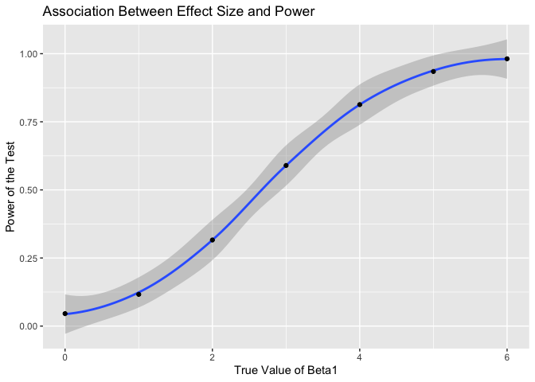
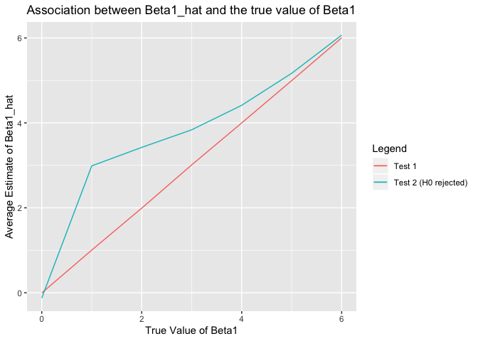

p8105\_hw5\_bg2645
================
Bing Bing Guo
11/6/2019

## Problem 1

``` r
set.seed(10)

iris_with_missing = iris %>% 
  map_df(~replace(.x, sample(1:150, 20), NA)) %>%
  mutate(Species = as.character(Species))
```

  - For numeric variables,replace “NA” with the mean of non-missing
    values. For character variables, replace “NA” with “virginica”.

<!-- end list -->

``` r
insert_new = function(x) {
  if(is.numeric(x) == TRUE) {
    x = x %>%
      replace_na(mean(x, na.rm = TRUE))
  }
  
else if(is.character(x) == TRUE){
  x = x %>%
    replace_na("virginica")
 }

return(x)

}

iris_with_missing = map_df(iris_with_missing,insert_new) 

iris_with_missing
```

    ## # A tibble: 150 x 5
    ##    Sepal.Length Sepal.Width Petal.Length Petal.Width Species
    ##           <dbl>       <dbl>        <dbl>       <dbl> <chr>  
    ##  1         5.1          3.5         1.4         0.2  setosa 
    ##  2         4.9          3           1.4         0.2  setosa 
    ##  3         4.7          3.2         1.3         0.2  setosa 
    ##  4         4.6          3.1         1.5         1.19 setosa 
    ##  5         5            3.6         1.4         0.2  setosa 
    ##  6         5.4          3.9         1.7         0.4  setosa 
    ##  7         5.82         3.4         1.4         0.3  setosa 
    ##  8         5            3.4         1.5         0.2  setosa 
    ##  9         4.4          2.9         1.4         0.2  setosa 
    ## 10         4.9          3.1         3.77        0.1  setosa 
    ## # … with 140 more rows

## Problem 2

  - Create a tidy dataframe containing data from all participants,
    including the subject ID, arm, and observations over time

<!-- end list -->

``` r
longstudy_files = list.files(path = "./data",full.names = TRUE) %>% 
  map(read.csv) %>% 
  reduce(rbind) %>% 
  janitor::clean_names() %>%
  mutate(subject_id = c(1:20), 
         arm = ifelse(subject_id == c(1:10), "control",
                     "experimental")) %>% 
  gather(key = week, value = observation, week_1:week_8) %>% 
  mutate(week = str_replace(week, "week_", ""))
```

  - Make a spaghetti plot showing observations on each subject over time

<!-- end list -->

``` r
longstudy_files %>% 
  ggplot(aes(x = week, y = observation)) + 
  geom_line(aes(group = subject_id, color = arm)) + 
   labs(
    title = "Observation For Subjects Over Time",
    x = "Week",
    y = "Observation",
    caption = "Data from a longitudinal study that included a control arm and an experimental arm"
   )
```

<!-- -->

  - Based on the graph, observation values for subjects in the
    experimental arm seemed to increase as the weeks progressed - thus
    in general there was a positive upward trend. However, for
    participants in the control arm the observation values seemed to
    stay fairly constant, though with slight fluctuations, as the weeks
    progressed.

## Problem 3

Conduct a simulation to explore power in a simple linear regression

  - Create function and set design elements

<!-- end list -->

``` r
set.seed(1)
sim_regression = function(n=30, beta0 = 2, beta1 = 0) {
  sim_data = tibble(
    x = rnorm(n, mean=0, sd = 1),
    y = beta0 + beta1 * x + rnorm(n, 0, sqrt(50))
    )
  ls_fit = lm(y ~ x, data = sim_data) %>%
  broom::tidy()
  tibble( 
    beta1_hat = ls_fit[[2,2]],
    p_value=ls_fit[[2,5]]
    )
}
```

  - Generate 10000 datasets from the model

<!-- end list -->

``` r
set.seed(1)

sim_results = rerun (10000, sim_regression(beta1 = 0)) %>% 
  bind_rows()

sim_results
```

    ## # A tibble: 10,000 x 2
    ##    beta1_hat p_value
    ##        <dbl>   <dbl>
    ##  1   0.296     0.798
    ##  2   0.00648   0.996
    ##  3  -2.16      0.155
    ##  4  -0.454     0.718
    ##  5  -0.514     0.730
    ##  6   1.71      0.243
    ##  7  -1.18      0.322
    ##  8   1.09      0.366
    ##  9   0.806     0.377
    ## 10   2.35      0.131
    ## # … with 9,990 more rows

  - Repeat the above for beta1 ={1,2,3,4,5,6}

<!-- end list -->

``` r
  new_sim_results = 
  tibble(new_beta1 = c(1,2,3,4,5,6)) %>% 
  mutate(
    output_lists = map(.x = new_beta1, ~rerun(10000, sim_regression(beta1 = .x))),
    estimate_dfs = map(output_lists, bind_rows)) %>% 
  select(-output_lists) %>% 
  unnest(estimate_dfs)
new_sim_results
```

    ## # A tibble: 60,000 x 3
    ##    new_beta1 beta1_hat p_value
    ##        <dbl>     <dbl>   <dbl>
    ##  1         1    3.03    0.0247
    ##  2         1    1.39    0.295 
    ##  3         1    1.93    0.103 
    ##  4         1    0.0151  0.990 
    ##  5         1    0.111   0.944 
    ##  6         1   -1.24    0.366 
    ##  7         1    1.02    0.301 
    ##  8         1    1.82    0.223 
    ##  9         1    2.35    0.0765
    ## 10         1    2.46    0.0966
    ## # … with 59,990 more rows

**Make a plot showing the proportion of times the null was rejected (the
power of the test) on the y axis and the true value of beta1 on the x
axis.**

``` r
new_sim_results %>% 
mutate(
  p_value = as.numeric(case_when(
    p_value < 0.05 ~ "1",
    p_value >= 0.05 ~ "0"))) %>% 
  group_by(new_beta1) %>% 
             summarise(power = mean(p_value)) %>% 
ggplot(aes(x = new_beta1, y = power)) + 
  geom_smooth() + geom_point() + 
  labs(
    title = "Association Between Effect Size and Power",
    x = "True Value of Beta1",
    y = "Power of the Test"
   )
```

    ## `geom_smooth()` using method = 'loess' and formula 'y ~ x'

    ## Warning in simpleLoess(y, x, w, span, degree = degree, parametric =
    ## parametric, : Chernobyl! trL>n 6
    
    ## Warning in simpleLoess(y, x, w, span, degree = degree, parametric =
    ## parametric, : Chernobyl! trL>n 6

    ## Warning in sqrt(sum.squares/one.delta): NaNs produced

    ## Warning in stats::qt(level/2 + 0.5, pred$df): NaNs produced

<!-- -->

  - Based on the plot above, it can be seen that as the true value of
    beta2 increases, the power of the test also increases. Thus, there
    is a linear relationship between the true value of beta2 and the
    power of the test.

**Make a plot showing the average estimate of beta1 on the y axis and
the true value of beta1 on the x axis. Make a second plot (or overlay on
the first) the average estimate of beta1 *only in samples* for which the
null was rejected on the y axis and the true value of beta1 on the x
axis.**

``` r
true_val = new_sim_results %>%
group_by(new_beta1) %>% 
summarise(average_1 = mean(beta1_hat))

null_reject = new_sim_results %>%
filter (p_value < 0.05) %>% 
group_by(new_beta1) %>% 
summarize(average_2 = mean(beta1_hat))

ggplot(true_val, aes(x = new_beta1, y = average_1)) +
geom_line(aes(color = "Test 1"))  +
  geom_line(data = null_reject, aes(x= new_beta1, y = average_2, color = "Test 2 (H0 rejected)")) +
  labs(
    color="Legend",
    title = "Association between Beta1_hat and the true value of Beta1",
    x = "True Value of Beta1",
    y = "Average Estimate of Beta1_hat"
   )
```

<!-- -->

  - The sample average of beta1\_hat across tests for which the null is
    rejected is not equal to the true value of beta1. There is a larger
    difference when the true value of beta 1 is small, as the true value
    of beta 1 increases the difference between the two tests becomes
    smaller.
