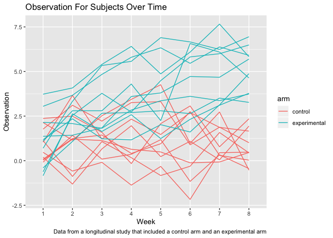

p8105\_hw5\_bg2645
================
Bing Bing Guo
11/6/2019

## Problem 1

``` r
set.seed(10)

iris_with_missing = iris %>% 
  map_df(~replace(.x, sample(1:150, 20), NA)) %>%
  mutate(Species = as.character(Species))
```

  - For numeric variables,replace “NA” with the mean of non-missing
    values. For character variables, replace “NA” with “virginica”.

<!-- end list -->

``` r
insert_new = function(x) {
  if(is.numeric(x) == TRUE) {
    x = x %>%
      replace_na(mean(x, na.rm = TRUE))
  }
  
else if(is.character(x) == TRUE){
  x = x %>%
    replace_na("virginica")
 }

return(x)

}

iris_with_missing = map_df(iris_with_missing,insert_new) 

iris_with_missing
```

    ## # A tibble: 150 x 5
    ##    Sepal.Length Sepal.Width Petal.Length Petal.Width Species
    ##           <dbl>       <dbl>        <dbl>       <dbl> <chr>  
    ##  1         5.1          3.5         1.4         0.2  setosa 
    ##  2         4.9          3           1.4         0.2  setosa 
    ##  3         4.7          3.2         1.3         0.2  setosa 
    ##  4         4.6          3.1         1.5         1.19 setosa 
    ##  5         5            3.6         1.4         0.2  setosa 
    ##  6         5.4          3.9         1.7         0.4  setosa 
    ##  7         5.82         3.4         1.4         0.3  setosa 
    ##  8         5            3.4         1.5         0.2  setosa 
    ##  9         4.4          2.9         1.4         0.2  setosa 
    ## 10         4.9          3.1         3.77        0.1  setosa 
    ## # … with 140 more rows

## Problem 2

  - Create a tidy dataframe containing data from all participants,
    including the subject ID, arm, and observations over time

<!-- end list -->

``` r
longstudy_files = list.files(path = "./data",full.names = TRUE) %>% 
  map(read.csv) %>% 
  reduce(rbind) %>% 
  janitor::clean_names() %>%
  mutate(subject_id = c(1:20), 
         arm = ifelse(subject_id == c(1:10), "control",
                     "experimental")) %>% 
  gather(key = week, value = observation, week_1:week_8) %>% 
  mutate(week = str_replace(week, "week_", ""))
longstudy_files
```

    ##     subject_id          arm week observation
    ## 1            1      control    1        0.20
    ## 2            2      control    1        1.13
    ## 3            3      control    1        1.77
    ## 4            4      control    1        1.04
    ## 5            5      control    1        0.47
    ## 6            6      control    1        2.37
    ## 7            7      control    1        0.03
    ## 8            8      control    1       -0.08
    ## 9            9      control    1        0.08
    ## 10          10      control    1        2.14
    ## 11          11 experimental    1        3.05
    ## 12          12 experimental    1       -0.84
    ## 13          13 experimental    1        2.15
    ## 14          14 experimental    1       -0.62
    ## 15          15 experimental    1        0.70
    ## 16          16 experimental    1        3.73
    ## 17          17 experimental    1        1.18
    ## 18          18 experimental    1        1.37
    ## 19          19 experimental    1       -0.40
    ## 20          20 experimental    1        1.09
    ## 21           1      control    2       -1.31
    ## 22           2      control    2       -0.88
    ## 23           3      control    2        3.11
    ## 24           4      control    2        3.66
    ## 25           5      control    2       -0.58
    ## 26           6      control    2        2.50
    ## 27           7      control    2        1.21
    ## 28           8      control    2        1.42
    ## 29           9      control    2        1.24
    ## 30          10      control    2        1.15
    ## 31          11 experimental    2        3.67
    ## 32          12 experimental    2        2.63
    ## 33          13 experimental    2        2.08
    ## 34          14 experimental    2        2.54
    ## 35          15 experimental    2        3.33
    ## 36          16 experimental    2        4.08
    ## 37          17 experimental    2        2.35
    ## 38          18 experimental    2        1.43
    ## 39          19 experimental    2        1.08
    ## 40          20 experimental    2        2.80
    ## 41           1      control    3        0.66
    ## 42           2      control    3        1.07
    ## 43           3      control    3        2.22
    ## 44           4      control    3        1.22
    ## 45           5      control    3       -0.09
    ## 46           6      control    3        1.59
    ## 47           7      control    3        1.13
    ## 48           8      control    3        0.09
    ## 49           9      control    3        1.44
    ## 50          10      control    3        2.52
    ## 51          11 experimental    3        4.84
    ## 52          12 experimental    3        1.64
    ## 53          13 experimental    3        1.82
    ## 54          14 experimental    3        3.78
    ## 55          15 experimental    3        5.34
    ## 56          16 experimental    3        5.40
    ## 57          17 experimental    3        1.23
    ## 58          18 experimental    3        1.84
    ## 59          19 experimental    3        2.66
    ## 60          20 experimental    3        2.80
    ## 61           1      control    4        1.96
    ## 62           2      control    4        0.17
    ## 63           3      control    4        3.26
    ## 64           4      control    4        2.33
    ## 65           5      control    4       -1.37
    ## 66           6      control    4       -0.16
    ## 67           7      control    4        0.64
    ## 68           8      control    4        0.36
    ## 69           9      control    4        0.41
    ## 70          10      control    4        3.44
    ## 71          11 experimental    4        5.80
    ## 72          12 experimental    4        2.58
    ## 73          13 experimental    4        2.84
    ## 74          14 experimental    4        2.73
    ## 75          15 experimental    4        5.57
    ## 76          16 experimental    4        6.41
    ## 77          17 experimental    4        1.17
    ## 78          18 experimental    4        3.60
    ## 79          19 experimental    4        2.70
    ## 80          20 experimental    4        4.30
    ## 81           1      control    5        0.23
    ## 82           2      control    5       -0.83
    ## 83           3      control    5        3.31
    ## 84           4      control    5        1.47
    ## 85           5      control    5       -0.32
    ## 86           6      control    5        2.08
    ## 87           7      control    5        0.49
    ## 88           8      control    5        1.18
    ## 89           9      control    5        0.95
    ## 90          10      control    5        4.26
    ## 91          11 experimental    5        6.33
    ## 92          12 experimental    5        1.24
    ## 93          13 experimental    5        3.36
    ## 94          14 experimental    5        4.49
    ## 95          15 experimental    5        6.90
    ## 96          16 experimental    5        4.87
    ## 97          17 experimental    5        2.02
    ## 98          18 experimental    5        3.80
    ## 99          19 experimental    5        2.80
    ## 100         20 experimental    5        2.25
    ## 101          1      control    6        1.09
    ## 102          2      control    6       -0.31
    ## 103          3      control    6        0.89
    ## 104          4      control    6        2.70
    ## 105          5      control    6       -2.17
    ## 106          6      control    6        3.07
    ## 107          7      control    6       -0.12
    ## 108          8      control    6       -1.16
    ## 109          9      control    6        2.75
    ## 110         10      control    6        0.97
    ## 111         11 experimental    6        5.46
    ## 112         12 experimental    6        2.32
    ## 113         13 experimental    6        3.61
    ## 114         14 experimental    6        5.82
    ## 115         15 experimental    6        6.66
    ## 116         16 experimental    6        6.09
    ## 117         17 experimental    6        1.61
    ## 118         18 experimental    6        4.72
    ## 119         19 experimental    6        2.64
    ## 120         20 experimental    6        6.57
    ## 121          1      control    7        0.05
    ## 122          2      control    7        1.58
    ## 123          3      control    7        1.88
    ## 124          4      control    7        1.87
    ## 125          5      control    7        0.45
    ## 126          6      control    7        0.78
    ## 127          7      control    7       -0.07
    ## 128          8      control    7        0.33
    ## 129          9      control    7        0.30
    ## 130         10      control    7        2.73
    ## 131         11 experimental    7        6.38
    ## 132         12 experimental    7        3.11
    ## 133         13 experimental    7        3.37
    ## 134         14 experimental    7        6.00
    ## 135         15 experimental    7        6.24
    ## 136         16 experimental    7        7.66
    ## 137         17 experimental    7        3.13
    ## 138         18 experimental    7        4.68
    ## 139         19 experimental    7        3.51
    ## 140         20 experimental    7        6.09
    ## 141          1      control    8        1.94
    ## 142          2      control    8        0.44
    ## 143          3      control    8        1.01
    ## 144          4      control    8        1.66
    ## 145          5      control    8        0.48
    ## 146          6      control    8        2.35
    ## 147          7      control    8        0.46
    ## 148          8      control    8       -0.44
    ## 149          9      control    8        0.03
    ## 150         10      control    8       -0.53
    ## 151         11 experimental    8        5.91
    ## 152         12 experimental    8        3.78
    ## 153         13 experimental    8        3.74
    ## 154         14 experimental    8        6.49
    ## 155         15 experimental    8        6.95
    ## 156         16 experimental    8        5.83
    ## 157         17 experimental    8        4.88
    ## 158         18 experimental    8        5.70
    ## 159         19 experimental    8        3.27
    ## 160         20 experimental    8        4.64

  - Make a spaghetti plot showing observations on each subject over time

<!-- end list -->

``` r
longstudy_files %>% 
  ggplot(aes(x = week, y = observation)) + 
  geom_line(aes(group = subject_id, color = arm)) + 
   labs(
    title = "Observation For Subjects Over Time",
    x = "Week",
    y = "Observation",
    caption = "Data from a longitudinal study that included a control arm and an experimental arm"
   )
```

<!-- -->

  - Based on the graph, observation values for subjects in the
    experimental arm seemed to increase as the weeks progressed - thus
    in general there was a positive upward trend. However, for
    participants in the control arm the observation values seemed to
    stay fairly constant, though with slight fluctuations, as the weeks
    progressed.

## Problem 3

Conduct a simulation to explore power in a simple linear regression

  - Create function and set design elements

<!-- end list -->

``` r
set.seed(1)
sim_regression = function(n=30, beta0 = 2, beta1 = 0) {
  sim_data = tibble(
    x = rnorm(n, mean=0, sd = 1),
    y = beta0 + beta1 * x + rnorm(n, 0, sqrt(50))
    )
  ls_fit = lm(y ~ x, data = sim_data) %>%
  broom::tidy()
  tibble( 
    beta1_hat = ls_fit[[2,2]],
    p_value=ls_fit[[2,5]]
    )
}
```

  - Generate 10000 datasets from the model

<!-- end list -->

``` r
set.seed(1)

sim_results = rerun (10000, sim_regression(beta1 = 0)) %>% 
  bind_rows()

sim_results
```

    ## # A tibble: 10,000 x 2
    ##    beta1_hat p_value
    ##        <dbl>   <dbl>
    ##  1   0.296     0.798
    ##  2   0.00648   0.996
    ##  3  -2.16      0.155
    ##  4  -0.454     0.718
    ##  5  -0.514     0.730
    ##  6   1.71      0.243
    ##  7  -1.18      0.322
    ##  8   1.09      0.366
    ##  9   0.806     0.377
    ## 10   2.35      0.131
    ## # … with 9,990 more rows

  - Repeat the above for beta1 ={1,2,3,4,5,6}

<!-- end list -->

``` r
  new_sim_results = 
  tibble(new_beta1 = c(1,2,3,4,5,6)) %>% 
  mutate(
    output_lists = map(.x = new_beta1, 
                       ~rerun(10000, sim_regression(beta1 = .x))),
    estimate_dfs = map(output_lists, bind_rows)) %>% 
  select(-output_lists) %>% 
  unnest(estimate_dfs)
new_sim_results
```

    ## # A tibble: 60,000 x 3
    ##    new_beta1 beta1_hat p_value
    ##        <dbl>     <dbl>   <dbl>
    ##  1         1    3.03    0.0247
    ##  2         1    1.39    0.295 
    ##  3         1    1.93    0.103 
    ##  4         1    0.0151  0.990 
    ##  5         1    0.111   0.944 
    ##  6         1   -1.24    0.366 
    ##  7         1    1.02    0.301 
    ##  8         1    1.82    0.223 
    ##  9         1    2.35    0.0765
    ## 10         1    2.46    0.0966
    ## # … with 59,990 more rows

**Make a plot showing the proportion of times the null was rejected (the
power of the test) on the y axis and the true value of beta1 on the x
axis.**

``` r
new_sim_results %>% 
  group_by(new_beta1) %>% 
  summarize(
    n = n(),
    power = sum(p_value < 0.05)/n) %>% 
ggplot(aes(x = new_beta1, y = power)) + 
  geom_smooth() + geom_point() + 
  labs(
    title = "Association Between Effect Size and Power",
    x = "True Value of Beta1",
    y = "Power of the Test"
   )
```

    ## `geom_smooth()` using method = 'loess' and formula 'y ~ x'

    ## Warning in simpleLoess(y, x, w, span, degree = degree, parametric =
    ## parametric, : Chernobyl! trL>n 6
    
    ## Warning in simpleLoess(y, x, w, span, degree = degree, parametric =
    ## parametric, : Chernobyl! trL>n 6

    ## Warning in sqrt(sum.squares/one.delta): NaNs produced

    ## Warning in stats::qt(level/2 + 0.5, pred$df): NaNs produced

<!-- -->

  - Based on the plot above, it can be seen that as the true value of
    beta2 increases, the power of the test also increases. Thus,showing
    that when effect size increases the power of the test increases.

**Make a plot showing the average estimate of beta1 on the y axis and
the true value of beta1 on the x axis. Make a second plot (or overlay on
the first) the average estimate of beta1 *only in samples* for which the
null was rejected on the y axis and the true value of beta1 on the x
axis.**

``` r
true_val = new_sim_results %>%
group_by(new_beta1) %>% 
summarise(average_1 = mean(beta1_hat))

null_reject = new_sim_results %>%
filter (p_value < 0.05) %>% 
group_by(new_beta1) %>% 
summarize(average_2 = mean(beta1_hat))

ggplot(true_val, aes(x = new_beta1, y = average_1)) +
geom_line(aes(color = "Test 1"))  +
  geom_line(data = null_reject, aes(x= new_beta1, y = average_2, 
                                    color = "Test 2 (H0 rejected)")) +
  labs(
    color="Legend",
    title = "Association between Beta1_hat and the true value of Beta1",
    x = "True Value of Beta1",
    y = "Average Estimate of Beta1_hat"
   )
```

<!-- -->

  - Based on the two overlayed graphs in the figure above, it can be see
    that the sample average of beta1\_hat across tests for which the
    null is rejected is not equal to the true value of beta1. This is
    because there is a large difference when the true value of beta 1 is
    small, as the true value of beta1 increases the difference between
    the two tests becomes smaller.
